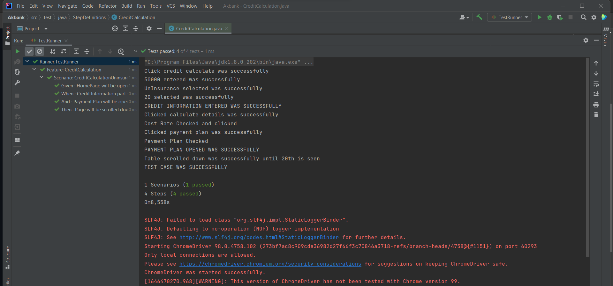
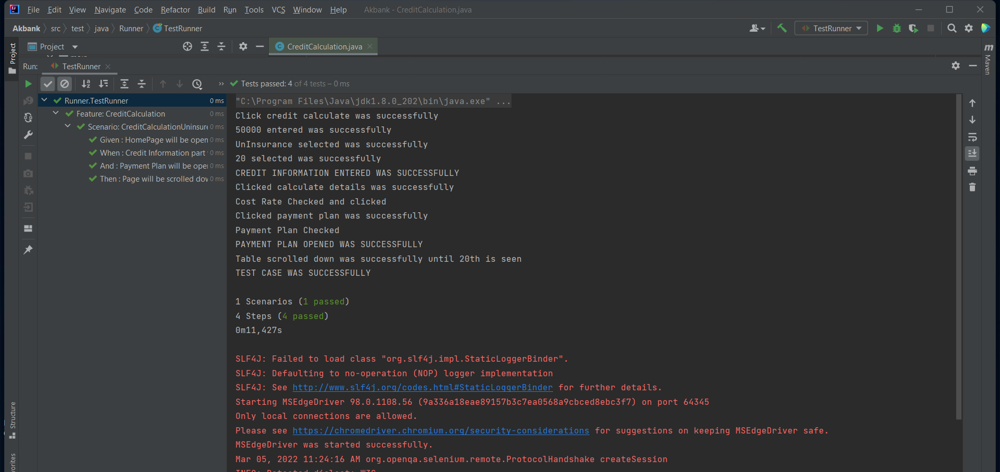

# AKBANKWEB
  <h1>NETAŞ - AKBANKWEB<h1/>

  <h2>Requirements</h2>
    *Chrome And Edge Web browser

  <h2>Steps<h2/>

* Enter Akbank Home Page; “akbank.com”  
* Scroll down to the bottom of the page  
* Click on “Kredi Hesaplama”  
* Enter “50000TL” in “TUTAR” field  
* Choose “SİGORTASIZ  
* Set “VADE” as “20 AY”  
* Click “Hesaplama Detayları”  
* Check “Masraf ve Maliyet Oranları” is opened  
* Click “Ödeme Planı”  
* Check “Ödeme Planı” is opened  
* Scroll down on the “Ödeme Planı” page until 20th is seen  

<h2>Images</h2>
    

  

<h2>Videos</h2>

https://user-images.githubusercontent.com/55651776/156876709-e3c3c794-1e92-42af-a8f2-315c81cfe146.mp4

    
